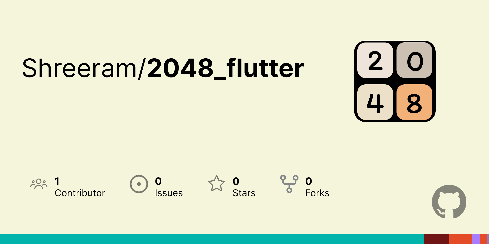

# 2048 Game in Flutter

 <!-- Replace with your image URL -->

## Overview

2048 is a popular single-player sliding block puzzle game. The objective is to slide numbered tiles on a grid to combine them to create a tile with the number 2048. This project is a Flutter implementation of the game, showcasing the capabilities of the Flutter framework.

## Features

- **Smooth Animations:** Enjoy fluid animations as tiles combine.
- **Responsive Design:** Works on both Android and iOS devices.
- **Score Tracking:** Keep track of your highest scores.
- **Undo Functionality:** Undo your last move if you change your mind.
- **Customizable Themes:** Change the look and feel of the game.

## Installation

To get started, clone this repository and run the app on your local machine.

```bash
git clone https://github.com/shreeramkedlaya/flutter_2048.git
cd twenty_forty_eight
flutter pub get
flutter run
```

## Screenshots

[Game Screenshot](https://example.com/screenshot1.png) <!-- Replace with your image URL -->
[Game Screenshot](https://example.com/screenshot2.png) <!-- Replace with your image URL -->

## How to Play

1. **Swipe** to move the tiles.
2. **Combine** tiles with the same number.
3. **Reach** the 2048 tile to win!

## Contributing

Contributions are welcome! Please follow these steps:

1. Fork the repository.
2. Create a new branch (`git checkout -b feature/YourFeature`).
3. Commit your changes (`git commit -m 'Add some feature'`).
4. Push to the branch (`git push origin feature/YourFeature`).
5. Open a Pull Request.

## Acknowledgements

- [Flutter](https://flutter.dev) - The framework used for this project.
- [2048 Game](https://2048-game.com) - Inspiration for the game.

---

Happy gaming! 🎮